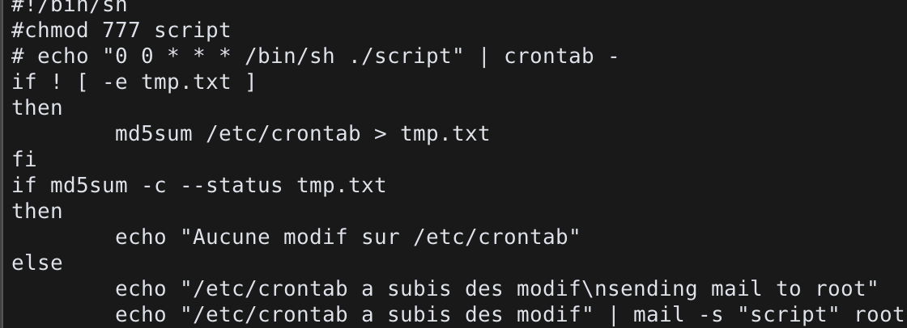

# 42-init
This first project, init, will give you the opportunity to discover system and network basic commands, many of the services used on a server machine, as well as a few ideas of scripts that can be useful for SysAdmins on a daily basis.

[42 Init subject](42-init.en.pdf)

[Norminette subject](https://github.com/Binary-Hackers/42_Subjects/blob/master/04_Norme/norme_2_0_1.pdf)

[Every 42 subject](https://github.com/agavrel/42_Subjects)
